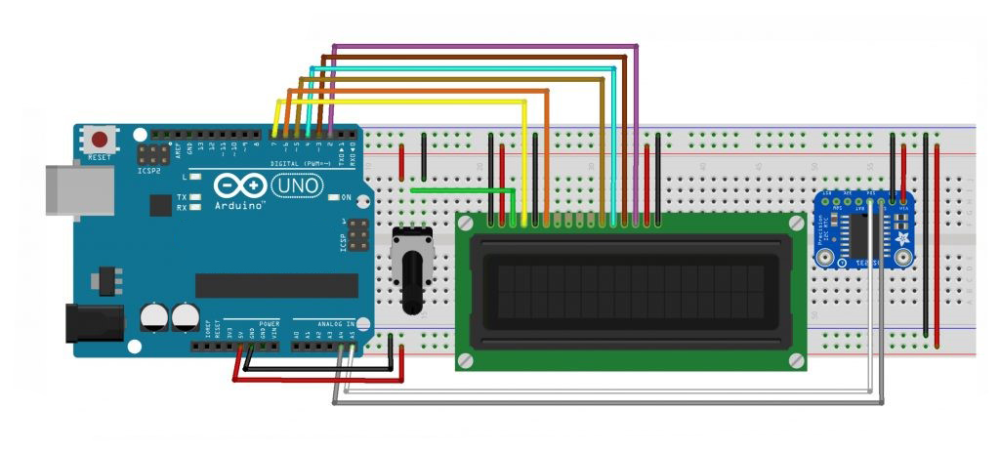

# LCD Digital Clock DS1307 with Arduino Uno

## Description

- Real Time Clock or RTC is a time indicator device in the form of an IC. RTC is an integral component of many important applications and devices related to time such as Servers, GPS, Data Loggers, etc. When connected to Arduino and a display, this module can function as a digital clock.

## Component (Tools & Materials):

- Arduino Uno: 1 unit;
- Breadboard / ProjectBoard: 1 unit;
- RTC DS1307 module: 1 unit;
- LCD 16×2: 1 unit;
- Potensiometer 10kΩ: 1 unit.

## Circuit Schematic:

- Below you can see a schematic image to facilitate the wiring of cables from the microcontroller to devices, both input and output sensors:

  

## Information Wiring:

- Pin pada LCD :
- Pin VSS – Ground
- Pin VDD – 5V
- Pin VO – Potensio
- Pin RS – Pin 7 Arduino
- Pin R_W – Ground
- Pin E – Pin 6 Arduino
- Pin DB4 – Pin 5 Arduino
- Pin DB5 – Pin 4 Arduino
- Pin DB6 – Pin 3 Arduino
- Pin DB7 – Pin 2 Arduino
- Pin A – 5V
- Pin K – Ground

Pin on Arduino :

- Pin A4 – Pin SCL
- Pin A5 – Pin SDA

## Sketch Code Program:

```cpp
#include <Wire.h>
#include <LiquidCrystal.h>
#include "RTClib.h"

DateTime now;
char daysOfTheWeek[7][12] = {"Min", "Sen", "Sel", "Rab", "Kam", "Jum", "Sab"};

RTC_DS3231 rtc;
LiquidCrystal lcd(7, 6, 5, 4, 3, 2);

void showDate(void);
void showTime(void);
void showDay(void);

void setup () {
    Serial.begin(9600);
    lcd.begin(16, 2);
    Wire.begin();
    if (! rtc.begin())   {
        Serial.println("Couldn't find RTC Module");
        while (1);
    }

    if (rtc.lostPower()) {
        Serial.println("RTC lost power, lets set the time!");
        rtc.adjust(DateTime(F(__DATE__), F(__TIME__)));
    }
    rtc.adjust(DateTime(F(__DATE__), F(__TIME__)));
}

void loop () {
    now = rtc.now();
    showDate();
    showDay();
    showTime();
}

void showDate() {
    lcd.setCursor(0, 0);
    lcd.print(now.day());
    lcd.print('/');
    lcd.print(now.month());
    lcd.print('/');
    lcd.print(now.year());
}

void showDay() {
    lcd.setCursor(11, 0);
    lcd.print(daysOfTheWeek[now.dayOfTheWeek()]);
}

void showTime() {
    lcd.setCursor(0, 1);
    lcd.print("Time:");
    lcd.print(now.hour());
    lcd.print(':');
    lcd.print(now.minute());
    lcd.print(':');
    lcd.print(now.second());
    lcd.print("    ");
    }

```

## Conclusion:

- The working of Arduino DS3231 RTC Module Interface is very simple. Arduino first initializes the RTC Module with its slave address (0x68 for DS3231 IC). Arduino then updates the RTC IC’s internal registers with the date and time at which the code was compiled and uploaded to Arduino. The uploaded date and time can be viewed on the 16×2 LCD display.
